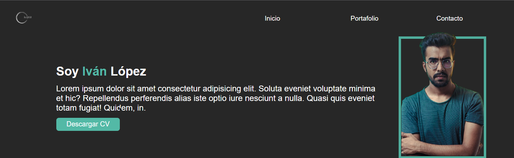

# ABOUT ME

Hola, soy Iván López Álvarez, soy de México y estoy estudiando de manera autodidacta desarrollo web, especializándome en el área del FrontEnd.

He aprendido los lenguajes básicos de esta área (HTML, CSS y JAVASCRIPT) tomando cursos en Youtube, y también tengo conocimiento sobre SASS y BOOSTSRAP.

Este pequeño proyecto es para poder practicar lo que he aprendido durante todo este tiempo y tratar de mojorarlo poco a poco, incluyendo nuevas funciones y utilizarlo como página web personal.
